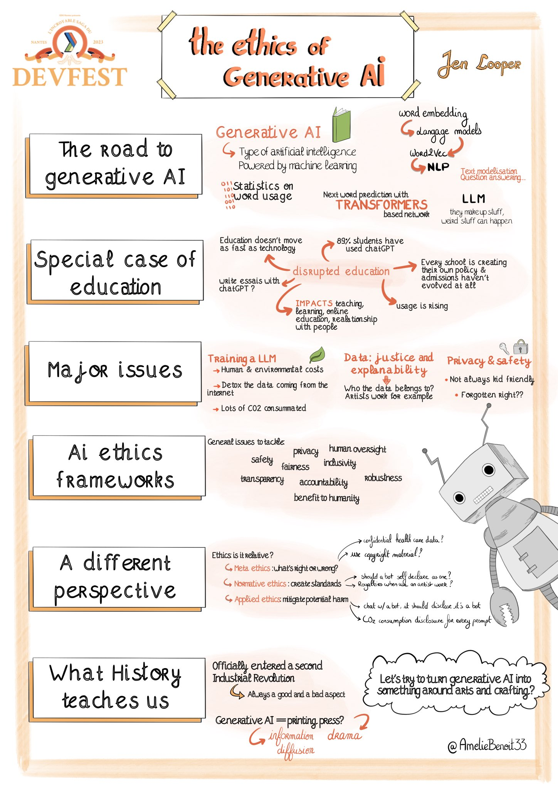
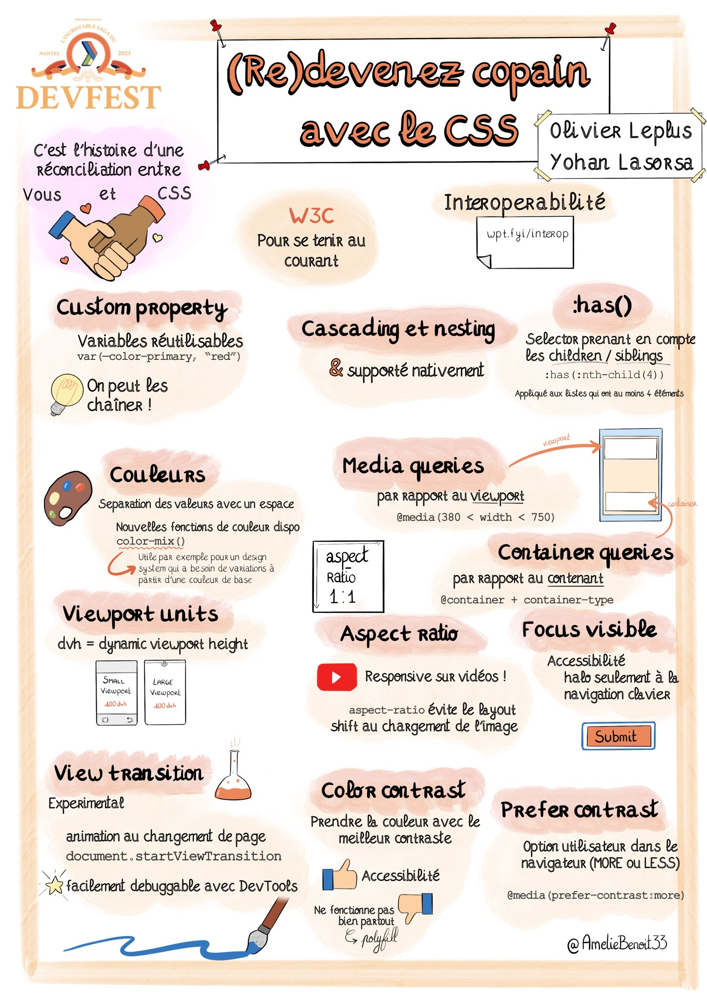
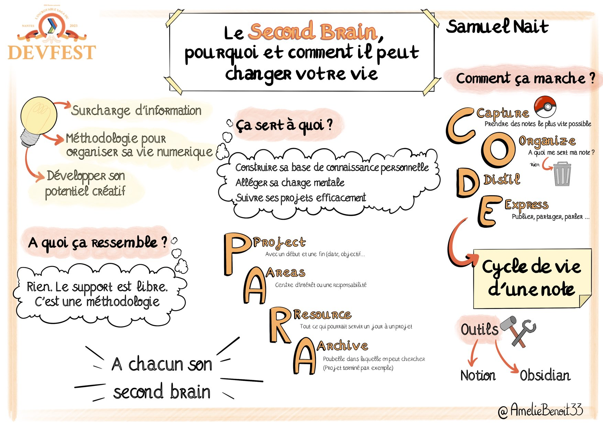
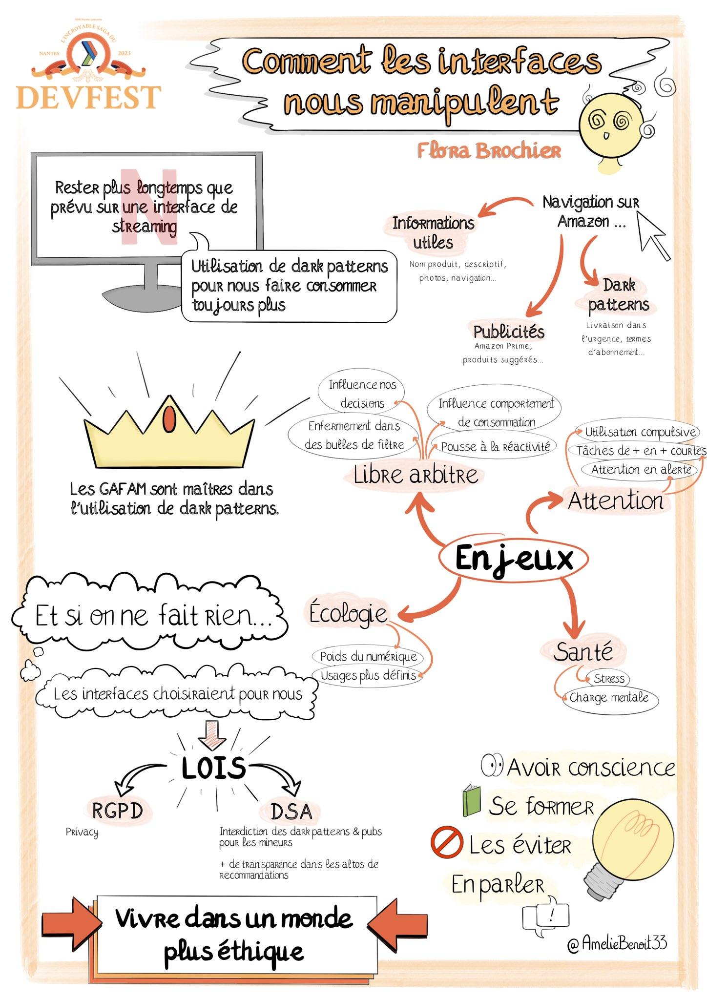

# DevFestNantes 2023 

All the recordings are available [here](https://www.youtube.com/playlist?list=PLuZ_sYdawLiUHU4E1i5RrFsRN_lQcgPwT)

## The Ethics of Generative AI

By **Jen Looper**

In a brave new world filled with unattributed text, filtered images, remixed sounds, and bot-generated refurbished art, where do we find ourselves? Can we merrily maneuver through ChatGPT to generate all the written text we ever need, park on the Midjourney Discord server to gather all the art we might ever want to look at, and listen to endlessly sampled sounds that melt away into the void? How are we to find our moral bearings in a morass of an ai-generated reality? In this talk, I’ll walk through a framework around understanding various aspects of the ethics of moral philosophy, and then working backwards to understand where generative AI fits into this framework and whether we can find acceptable use cases for it.

[Recording](https://youtu.be/NVne-IPcihM?feature=shared)

## CSS renaît de ses cendres: (re)devenez copains avec votre feuille de style

By **Olivier Leplus** & **Yohan Lasorsa**

On ne va pas se mentir: quand on a commencé notre aventure dans le développement web il y a 15 ans, le CSS et nous, ce n'était pas vraiment le grand amour. Malgré l'arrivée des variables et des nouveaux systèmes de layouts, on n'était toujours pas convaincus, et on ne l'utilisait que par obligation. En 2023, on a décidé de lui donner une nouvelle chance: comme pour le JavaScript, les nouveautés de CSS ont considérablement changé le langage ces dernières années, et on a été agréablement surpris.

Dans ce talk interactif et riche en démos, on abordera les standards existants et ceux à venir qui nous on fait redécouvrir le CSS. Préparez-vous à explorer des fonctionnalités cools telles que :is(), :has(), le nesting, les custom media queries, les custom properties (bien plus puissantes qu'on ne le pense) et bien d'autres innovations encore !

Rejoignez-nous pour donnez une nouvelle chance au CSS, qui pourrait bien devenir votre nouveau copain incontournable dans le développement front-end !

[Recording](https://youtu.be/jCk0cyjexNU?feature=shared)

## Le Second Brain, pourquoi et comment il peut changer votre vie.

By **Samuel Nait**

Aujourd'hui, l'organisation fait partie intégrante du métier de développeur, notre domaine évolue très vite, entre ce qu'on nous demande en passant dans un couloir, les mails qu'on reçoit à la pelle et les 35 idées de side projects qu'on a par jour, tout ça sans parler de la veille technique, il est facile de se sentir accablé et s'épuiser mentalement.

Le fait est que nous n'avons qu'un seul cerveau et qu'il faut faire avec... ou pas !

Pas la peine de taper "Greffe de cerveau" sur Google, ce n'est pas de ça que nous allons parler.

Le Second Brain, littéralement un second cerveau est une méthode d'organisation pour réduire sa charge mentale et se créer un espace virtuel où centraliser ses idées et organiser ses projets de manière efficace.

Découvrons ensemble les principes, méthodes et outils pour bâtir son propre Second Brain et arrêter d'avoir une cocotte minute à la place de la tête.

En utilisant le système CODE, la méthode PARA - suggérées par Tiago Forte, pionnier du Second Brain - et grâce aux bons logiciels, vous aurez toutes les clés pour bâtir une base solide pour votre propre Second Brain.

[Recording](https://youtu.be/itkeL7yx0yU?feature=shared)

## Comment les interfaces nous manipulent !

By **Flora Brochier**

L'avènement du numérique a fait de l’attention une ressource première et rare placée au cœur des modèles économiques des plateformes sociales ou de divertissement. À côté de cela, le nombre de design trompeur (ou dark pattern) a explosé en utilisant nos failles et nos biais. Faisons la lumière sur ces mécanismes trompeurs, leurs conséquences et les bonnes pratiques que nous, professionnels du numérique, pouvons mettre en place.

[Recording](https://youtu.be/iUNZUgJ8tqI?feature=shared)

