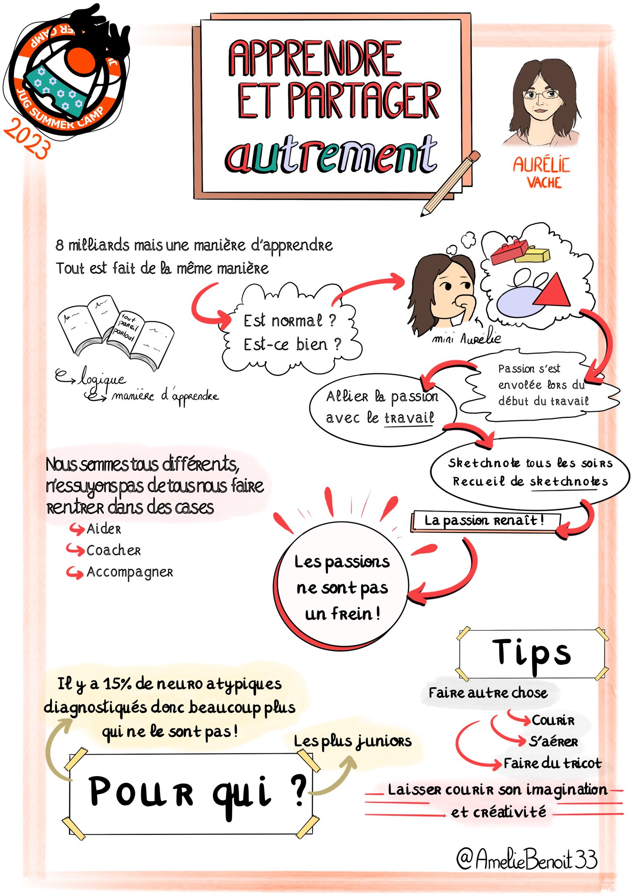
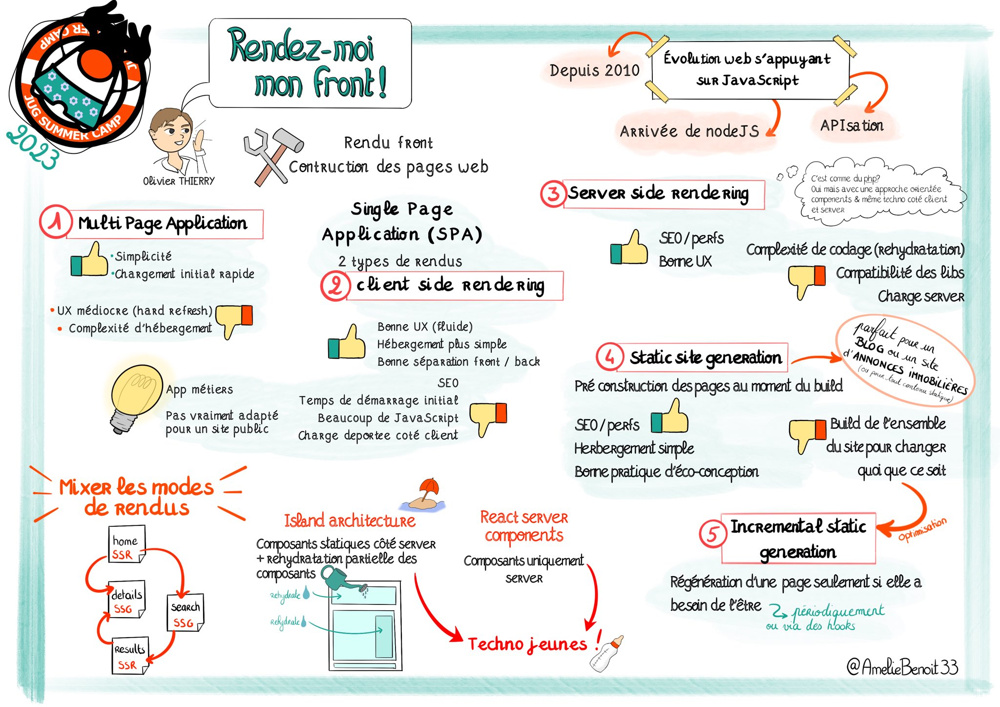
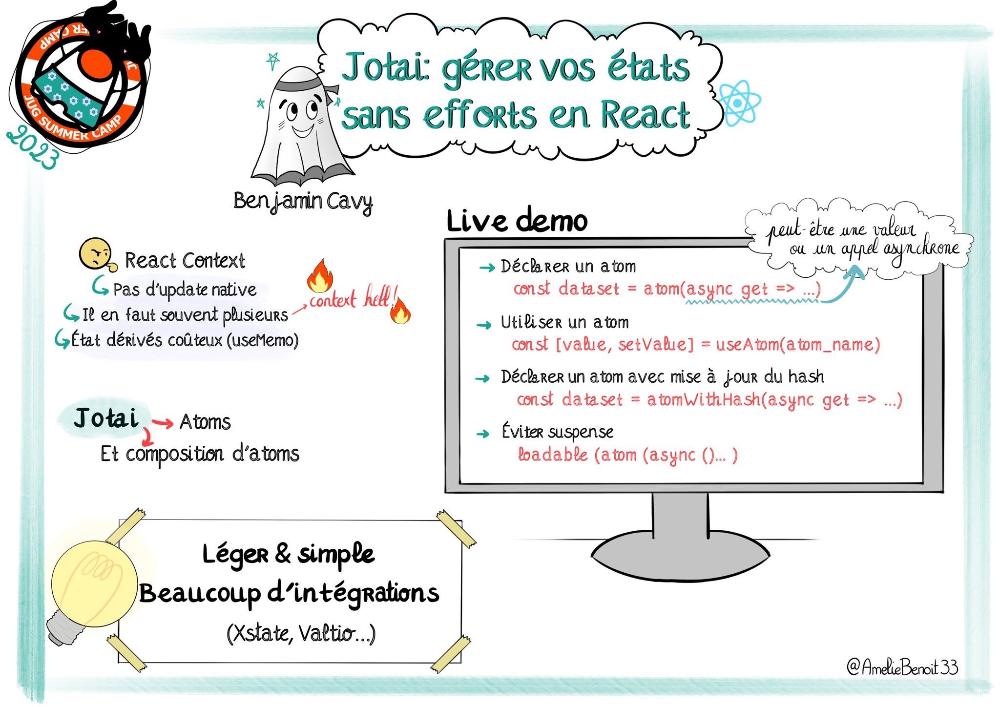
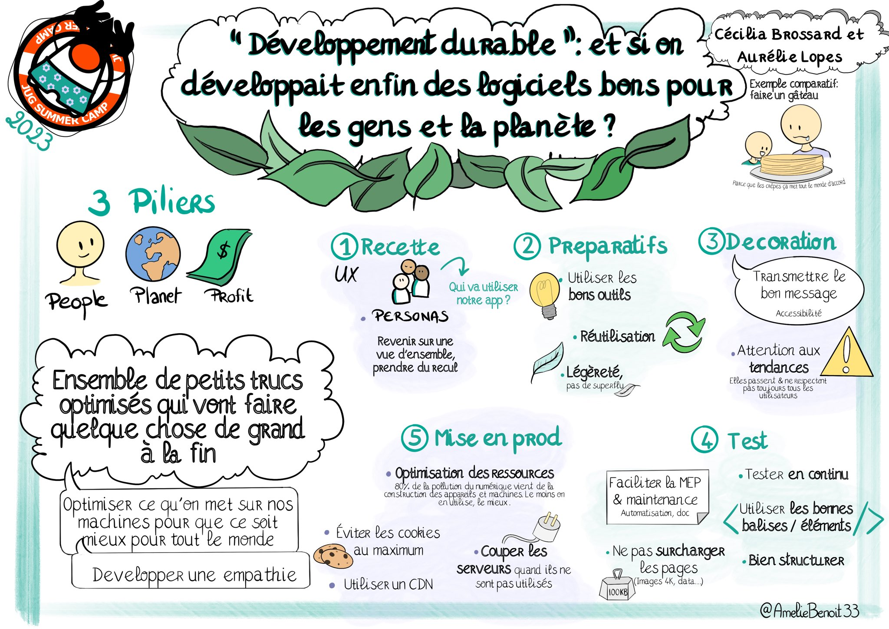

# JugSummerCamp 2023

All the conference's recordings are [here](https://youtube.com/playlist?list=PL4Z_Bm3ccVwf0w1N0sHqww80I2MZuXp4Z&feature=shared)

## (Et si on apprenait à) Apprendre et partager autrement

By **Aurélie Vache**

Nous sommes actuellement environ 8 milliards d’individus sur Terre et nous sommes tous différents mais nous devons rentrer dans des cases, suivre le même programme éducatif, et nous devons tous apprendre de la même manière.

Et si je vous disait qu'il est possible d'apprendre et de partager autrement, de faire appel à son imagination et à sa créativité et que c'est bénéfique pour tout le monde ?

Dans ce talk, je raconte une histoire, je vous raconte mon histoire, de comment je suis passée d'une personne qui avait perdu ses passions à la création de sketchnotes, vidéos, talks qui sortent du commun et de livres illustrés.

Partager autrement est-ce simple ? Peux t-on changer les choses ? Pourquoi ? Pour qui ? Il y a t'il des tips à savoir ?

Nous répondrons à toutes ces questions :-).

Et pour finir, nous verrons que nous avons chacun de super pouvoirs a utiliser à bon escient.

[Recording](https://youtu.be/KPZR3y2ICJg?feature=shared)

## SELECT 'amazing_features' FROM "posgresql"

By **Kevin Davin**

C'est unanime, PostgreSQL devient le Linux de la base de données pour le bien de tous 🚀!
Et cela parce que ce moteur de BDD contient des fonctionnalités fantastiques permettant de résoudre des problèmes complexes très simplement!

Venez découvrir dans cette présentation les features les plus utiles et pratiques pour vous éviter de tout re-coder "from scratch" 😅!
L'on détaillera des features standards du monde SQL trop peu connues et des features propres à PG qui en font un moteur SQL passionnant 🔥

Et pour terminer, l'on fera le tour des "distributions" PostgreSQL disponibles, car dans ce domaine, il y a beaucoup de choix, pour de l'on-prem ou dans le cloud ☁️

[Recording](https://youtu.be/a3rqfV1cE0I?feature=shared)

## Rendez-moi mon front !

By **Olivier Thierry**

Rendu côté client (CSR), rendu côté serveur (SSR), génération de sites statiques (SSG), regénération statique incrémentale (ISR), architecture en îlots, composants serveurs, … Difficile de se retrouver dans les modes de rendu proposés aujourd'hui par les différents écosystèmes front modernes.

Quels sont les principes de ces modes de rendu ? À quelles problématiques répondent-t-ils ? Quels sont leurs atouts et leurs limites ? Quels sont leurs contextes d'utilisation à privilégier ?

Je vous propose de partir à la découverte de ces différents modes de rendu front pour vous aider à choisir le mode le plus adapté à votre contexte, illustrés par des exemples dans l'écosystème React, mais valables sur l'ensemble des écosystèmes front.

[Recording](https://youtu.be/3FOGIo2aGFk?feature=shared)

## Jotai : gérer vos états sans efforts en React 

By **Benjamin Cavy**

Jotai est une librairie de gestion de l'état qui se veut simple et optimisée.

Elle permet notamment de partager sans effort des états simples entre n'importe quels composants sans impacter toute l'arborescence, évitant ainsi les problèmes habituels de "props drilling" ou le boilerplate associé à la mise en place d'un contexte.

Pour ne rien gâcher, la librairie est optimisée pour éviter tout re-rendu inutile et nous épargner l'usage de mémoïsation.

Cette présentation illustrera les principes et la mise en place de la librairie lors d'un live coding.

[Recording](https://youtu.be/J8cro3rekqA?feature=shared)

## Des logiciels bons pour les gens et la planète

By **Cécilia Bossard & Aurélie Lopes**

"People, Planet, Profit" : les 3 piliers du développement durable peuvent également s'appliquer au développement logiciel.

Comment faire rimer ces trois mots avec nos pratiques ?

Nous vous proposons un tour d'horizon avec des exemples concrets, de la conception UX au déploiement sur les serveurs, de bonnes pratiques d'éco-conception et d'accessibilité, et comment concilier toutes ces techniques avec un budget restreint.

[Recording](https://youtu.be/zFzO8QuxAtg?feature=shared)

