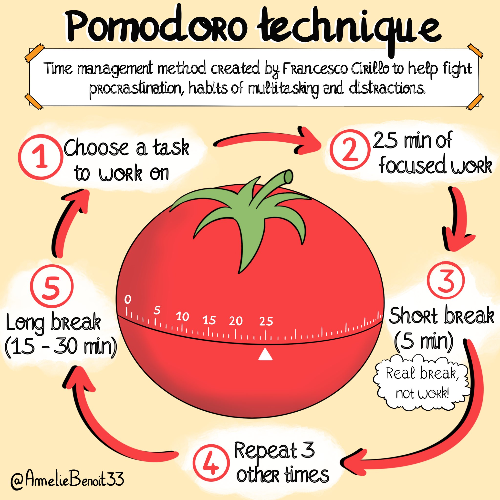
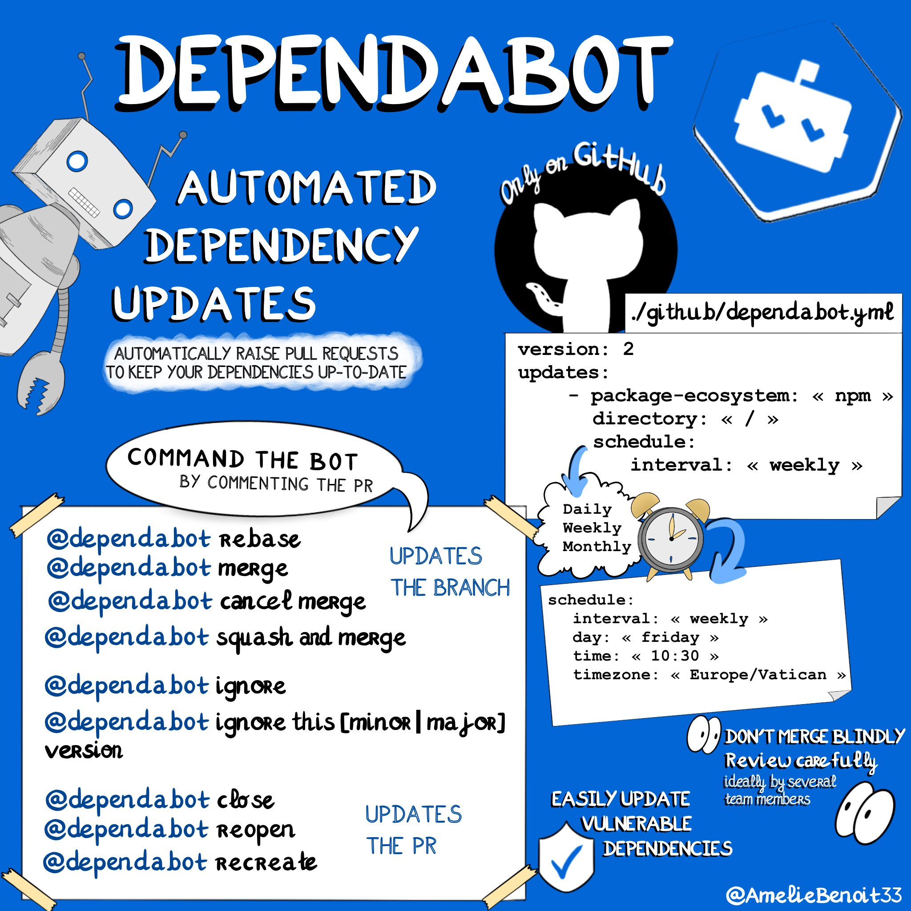

# Sketchnotes

As I create Sketchnotes on a wide variety of occasions, this repository serves as a central place where they are all organized and referenced.

I have created Sketchnotes for:
- **Personal interests**: To break down complex concepts or learn about topics I’m curious about. Sketchnoting is an excellent way to remember terms and ideas. The process of finding icons, personifying concepts, and synthesizing information also helps deepen my understanding.
- **Training sessions**: I sketchnoted all the summary chapters of an Angular training course. These notes were designed as takeaway summaries, providing learners with a concise format they could read or print as needed.
- **Conference talks**: I create Sketchnotes during tech conferences to capture the talks I attend. This helps me retain key points, share insights with my peers, and offers a thoughtful keepsake for speakers who put so much effort into their presentations.

If you’d like to collaborate on a project that could benefit from Sketchnotes, feel free to reach out!

## Misc

### Pomodoro technique 

### Dependabot 

## Conferences note taking 

## React Paris 2024

[React Paris](https://www.dotjs.io/) React C'est magique !

[Sketchnotes here](./React%20Paris%202024)

## DotJS 2024

[DotJS](https://www.dotjs.io/) The world's sharpest Javascript conference happening yearly in April.

[Sketchnotes here](./dotJS%202024)

## React Brussels 2024

[React Brussels](https://www.react.brussels/) The React conference in the heart of Europe.

[Sketchnotes here](./React%20Brussels%202024)

## JugSummerCamp 2023

[JugSummerCamp](https://www.jugsummercamp.org/edition/15) Tech conference in La Rochelle, Bordeaux.

[Sketchnotes here](./JugSummerCamp%202023)

## DevFest Nantes 2023

[DevFest Nantes](https://devfest2023.gdgnantes.com/en/) is a technical conference destined to developers. It's meant for students, professionals, or any curious techie

[Sketchnotes here](./Devfest%20Nantes%202023)

## Resources to learn sketchnotes 

I can't emphasize this enough: **you don't need to know how to draw to start sketchnoting**! 

If you can draw rectangles and circles, you're already set.

Over the years, I’ve made my sketchnotes more visually appealing, but that’s not what truly matters. The key elements are content, icons, text, and structure. Once you start experimenting with these, your sketchnotes will naturally become more impactful.

[Mike Rhodes' book](https://rohdesign.com/handbook) is an excellent resource for learning about sketchnoting—I’ve learned so much from it.

Feel free to check out some conferences such as [this one](https://youtu.be/sxyHF5pptgY) to dive deeper into the topic! 

