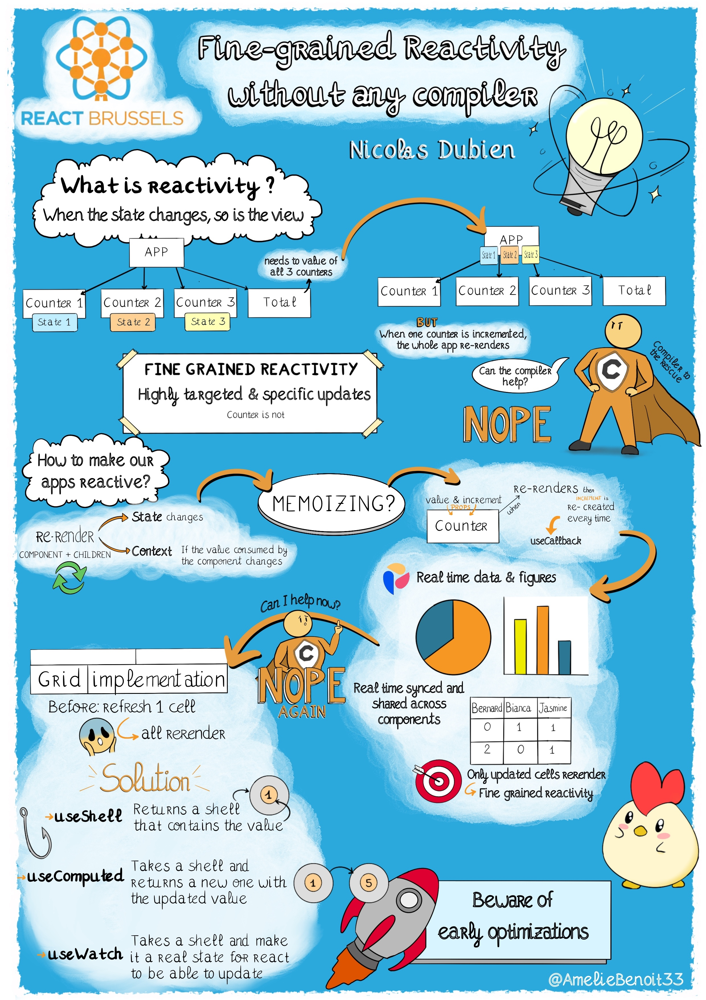
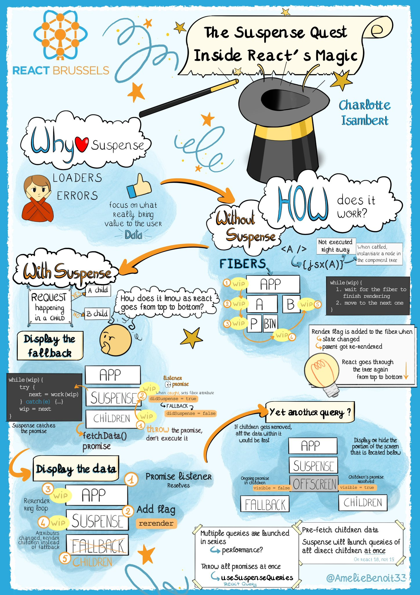
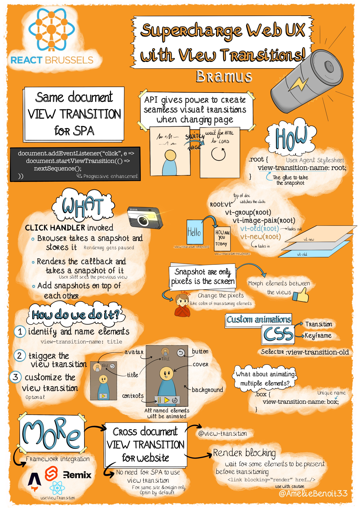
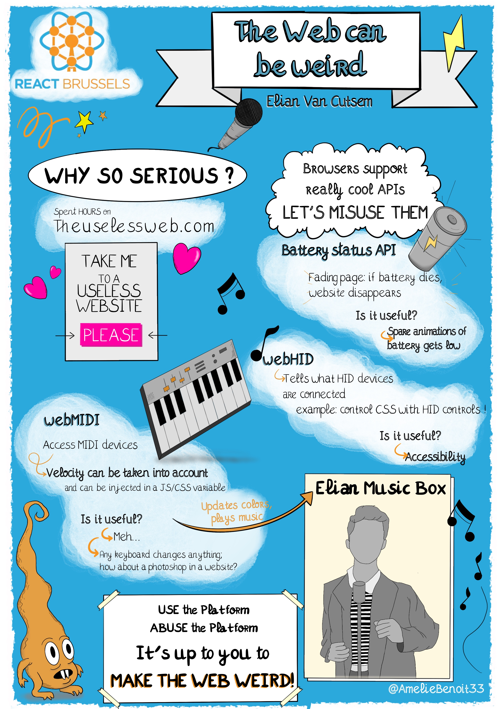
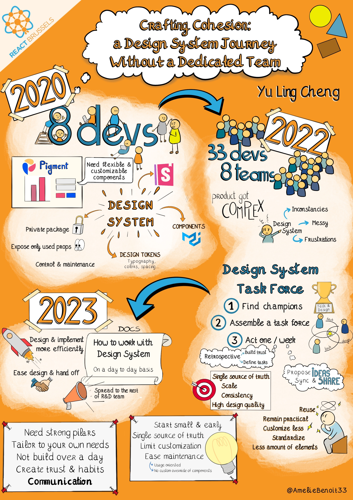
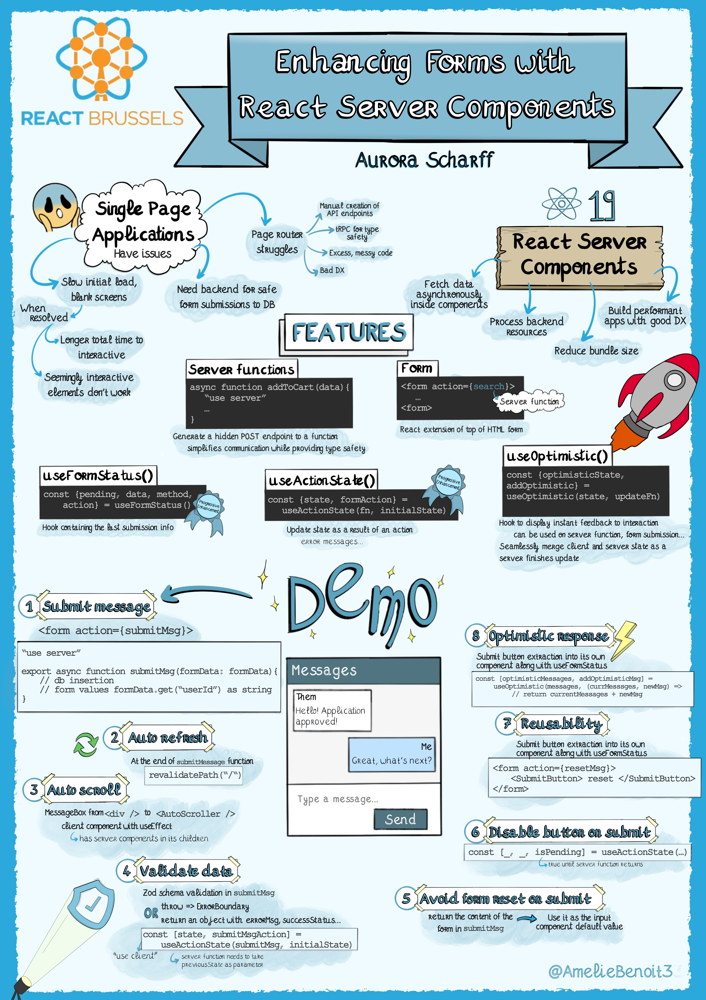
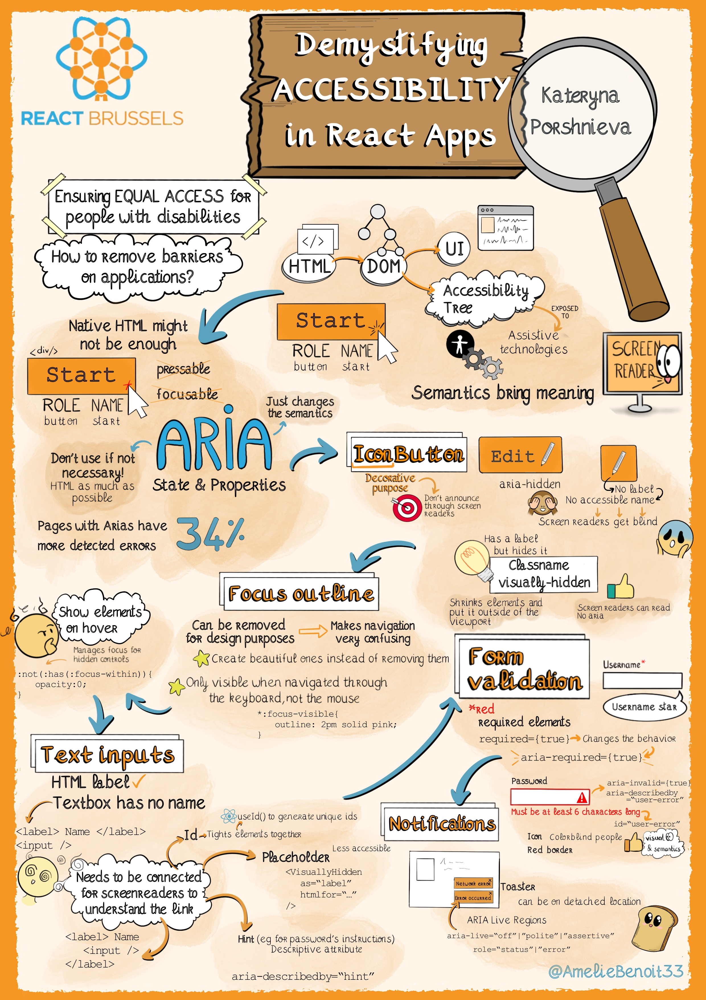
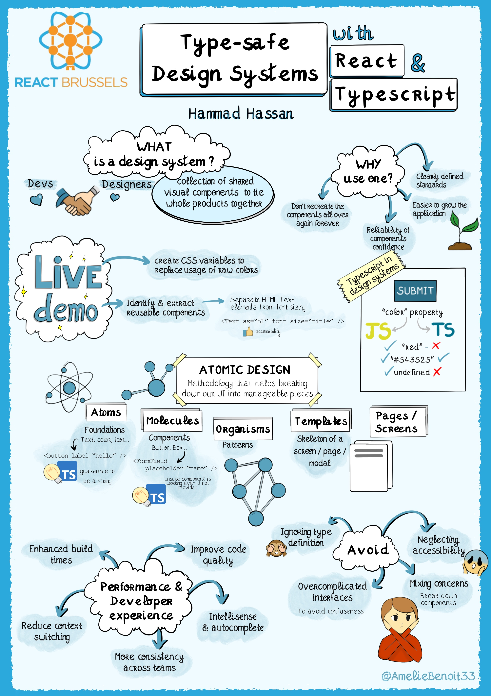

# React Brussels 2024

All the recordings are available [here](https://youtube.com/playlist?list=PL53Z0yyYnpWimQ0U75woee2zNUIFsiDC3&feature=shared).

## Fine Grained Reactivity without any compiler

By **Nicolas Dubien**

> Achieving high-performance reactivity in React without compromising the developer experience has always been a key challenge. When building real-time applications designed to display hundreds of millions of rows without noticeable lag, fine-grained reactivity is essential. But when I started my journey at Pigment, neither Recoil, Jotai, nor Zustand were mature enough, and React Compiler was not yet a thing. Let's explore together how we managed to ingest, display, and update huge datasets seamlessly without sacrificing the developer or the user experience.

[Recording](https://youtu.be/g92XUzc1OHY?feature=shared)

## The suspense quest Inside React's Magic

By **Charlotte Isambert**

> No more loaders, no more errors - Suspense has revolutionized the way developers handle asynchronous operations.
>    But have you ever wondered what magic enables Suspense to work? How does Suspense know it has to display a fallback because a query is going to happen in a component below?
>    In this talk, we’ll explore the inner workings of Suspense to uncover the magic that empowers one of the most beloved components of React.

[Recording](https://youtu.be/6-MYouU_GGk?feature=shared)

## Supercharge Web UX with View Transitions!

By **Bramus**

> Tired of disjointed web apps? View Transitions are the game-changer you've been waiting for. Whether your app is single or multi-page, this powerful API lets you create seamless, native-like experiences that captivate users. Join me as I dive into the world of View Transitions, showing you how to replace jarring page loads with elegant transitions. Learn to harness the flexibility of CSS and the power of JavaScript to customize transitions and create a truly unique experience. If you're ready to take your web apps to the next level, this talk is a must-attend.

[Recording](https://youtu.be/pMaAHpKFEAo?feature=shared)

## The web can be weird

By **Elian Van Cutsem**

> The web is capable of way more than we might think. During this talk, we'll explore some lesser known parts of the web. Did you know you can control the web via webHID or send notes to devices via webMIDI? In this interactive talk we might make some music together, by controlling synthesisers and exploring the wide range of strange web API's

[Recording](https://youtu.be/ZeE6Ryo4z68?feature=shared)

## Crafting Cohesion A Design System Journey Without a Dedicated Team

By **Yu Ling Cheng**

> Join me on a 4-year odyssey at Pigment, where our R&D team expanded from 10 to 80, building a flexible planning tool that integrates data import, modeling, real-time visualization, and reporting. Sit back and follow our adventure of developing and maintaining a Design System with no dedicated team. I will share key insights into:
>   - Our Origin Story: the initial spark that ignited our journey.
>   - Guidelines Tailoring: Adapting our process to fit our team dynamics.
>   - Component Evolution: Strategies for component split and lifecycle management.
>   - Decision-Making Flexibility: Adjusting our approach and processes.

[Recording](https://youtu.be/lCx9BfPFQlw?feature=shared)

## Enhancing Forms with React Server Components

By **Aurora Walberg Scharff**

> In this talk, we explore the application of React Server Components (RSC) to elevate the functionality and efficiency of forms. We will touch upon the core principles of RSC and their specific benefits for form development, such as improved load times and streamlined server-side processing. Attendees will gain insights into practical strategies for integrating RSC into forms, focusing on enhancing user experience and reducing frontend complexities.

[Recording](https://youtu.be/V0rRu7cevR0?feature=shared)

## Demystifying Accessibility in React Apps

By **Kateryna Porshnieva**

> Web Accessibility is nuanced and can be a tough topic to navigate and get right. In this talk, I aim to provide a practical guide to web accessibility in React apps, completed with many interactive examples.
>   
> We’ll start with brief introduction to web accessibility as a whole, we will explore the way assistive technology interacts with web pages, how accessibility tree is constructed and used to navigate web content. Then, we’ll go over a few common patterns in React apps and how to implement without compromising accessibility. This is going to be fun!

[Recording](https://youtu.be/YcVzu9w-N-g?feature=shared)

## Poly Monorepos, the Best of the Two Worlds

By **Jonathan Gelin**

> We often pit Polyrepos against Monorepos, but why not merge the best of both worlds?
>   
> In this presentation, I will demonstrate effective management of distributed monorepos from both decentralized and centralized perspectives.
>   
> We will delve into streamlining this complex process using Nx:
>    - By utilizing custom presets to generate new monorepos from scratch.
>    - By creating CLI commands to automatically set up local environments.
>    - By employing project-specific Nx plugins to automate the sharing of monorepo configurations.
>    - By implementing migrations to keep monorepos consistently up-to-date.
>    - By sharing toolkit configurations, such as Jest, Webpack, eslint, etc.
>    - By providing workshops and a support channel.
>   
> At the end of this talk, you will have all the necessary tools to maintain multiple large monorepos effortlessly

[Recording](https://youtu.be/z1AkcMwrn9E?feature=shared)

## Type Safe Design Systems with React & TypeScript

By **Hammad Hassan**

> I will talk about building the future of user interfaces! Have you ever struggled to keep your app's design consistent as it grows? This talk explores a powerful approach called "type-safe design systems" using React and TypeScript. Imagine creating building blocks for your app that perfectly fit together every time, like magic Legos! We'll dive into how this approach makes building your app faster, easier, and less error-prone.

## Distributed Apps, Module Federation, and Rewriting Webpack in Rust

By **Zack Jackson**

> As frontend applications grow in size and complexity, they become increasingly difficult to scale. Challenges arise with delivery, compile times, and cross-team dependencies. At ByteDance, with over 10,000 frontends, the demand and expectations on infrastructure tools are exceptionally high.
>   
> In this talk, we'll explore the tools we have developed and open-sourced to meet these expectations and support the rapid growth of our business. We'll delve into:
>   
> Why we rewrote Webpack in Rust to improve performance and efficiency.
>   
> Our adoption of Module Federation as a means of scaling frontends and the business impacts of this approach.
>   
> What's new in Module Federation 2 and how it addresses emerging challenges.
>   
> Strategies for orchestrating and managing distributed frontends at scale.
>   
> Our open-source roadmap and future plans for frontend infrastructure tooling.
>   
> Whether you're facing scaling challenges with frontend applications or simply interested in cutting-edge infrastructure solutions, this talk will provide valuable insights into ByteDance's approach and the innovative tools we've built to tackle these issues

