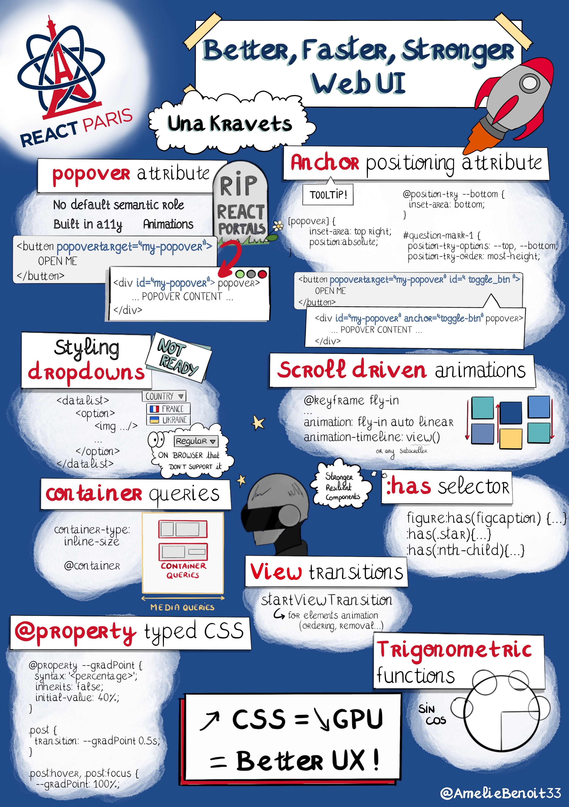
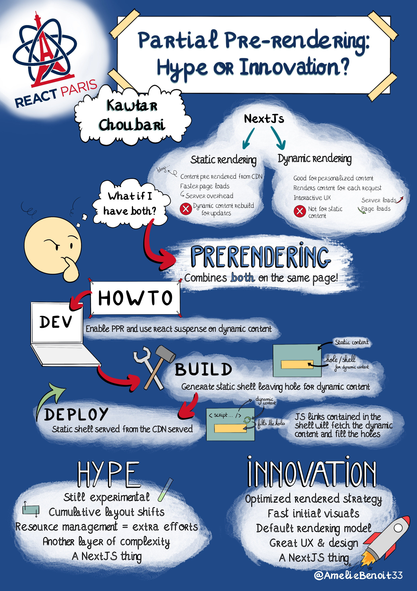
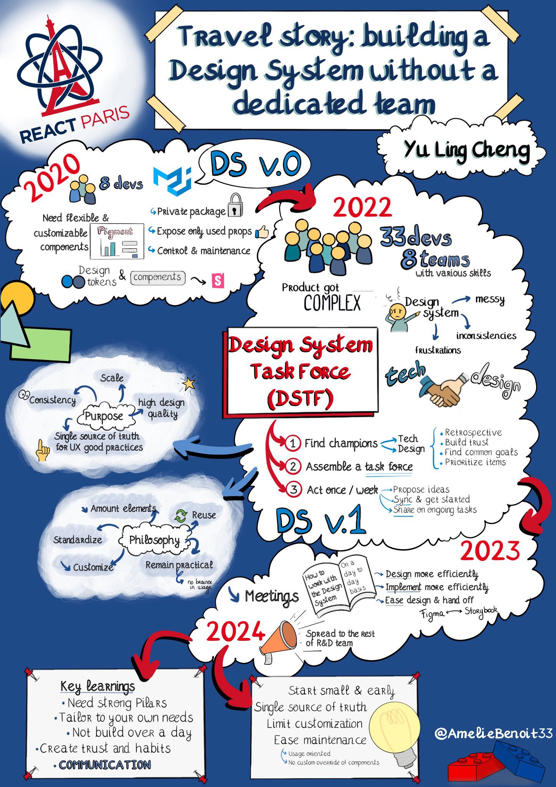

# React Paris 2024

All the recordings are available [here](https://youtube.com/playlist?list=PL53Z0yyYnpWhUzgvr2Nys3kZBBLcY0TA7&feature=shared).

## Better, Faster, Stronger Web UI

By **Una Kravets**

> The web platform has evolved massively in the past few years, especially in the UI space. In this talk, learn how to take advantage of new and upcoming web platform features to lower your script payload and let the browser take on state management and accessibility hooks. Learn about upcoming features like view transitions, CSS-only scroll-driven animations, native stateful popovers, as well as new primitives like nesting that could significantly reduce file size. This talk will help you level up your developer skillset and open your eyes to new ways to build web UIs.

[Recording](https://youtu.be/EB6dJTx9t54?feature=shared)

## Travel Story: Building a Design System Without a Dedicated Team

By **Kawtar Choubari**

> In this rapidly evolving world of web development, Next.js recently introduced Partial Prerendering (PPR), a new rendering model for web applications. But what exactly lies behind this concept? In this session, we will explore how PPR optimizes web applications by combining ultra-fast static delivery with real-time dynamic updates.
>   
> Key takeaways from this session include:
>    - Understanding the basics and benefits of Partial Prerendering
>    - Comparing PPR with traditional rendering methods like Client-Side Rendering (CSR) and Server-Side Rendering (SSR)
>   
> Examples showcasing PPR and its impact on performance and user experience

[Recording](https://youtu.be/1Xplez2KRaI?feature=shared)

## Travel Story: Building a Design System Without a Dedicated Team

By **Yu Ling Cheng**

> My ongoing 3-year journey at Pigment started with an R&D team of 10. Today, we’re over 60 building a flexible planning tool integrating data import and modeling, real-time visualization and reporting.
>   
> Building and maintaining our Design System has been quite an adventure since we chose not to have a dedicated team.
>   
> In this talk, I’ll share how we designed it and organize ourselves to make it work.

[Recording](https://youtu.be/AjOd90mXwLo?feature=shared)

