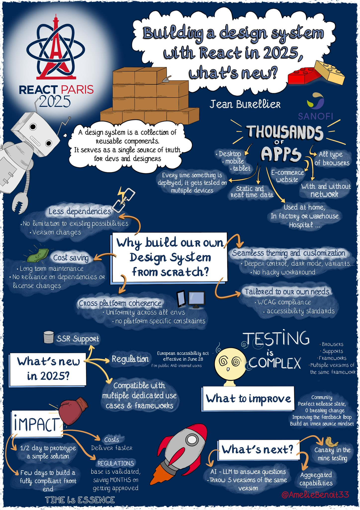
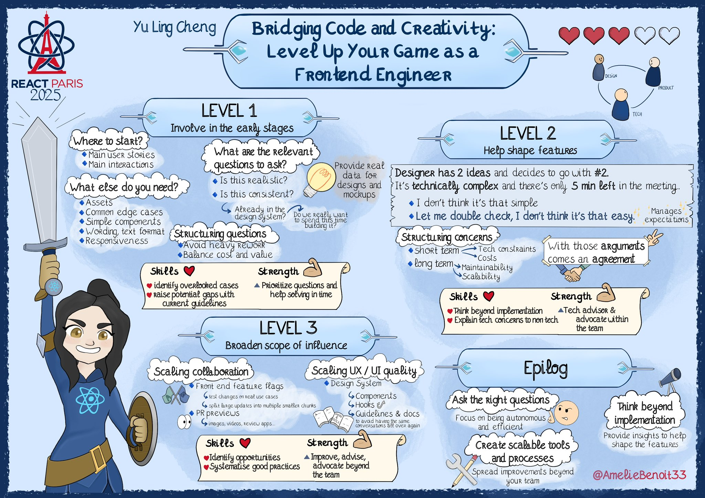
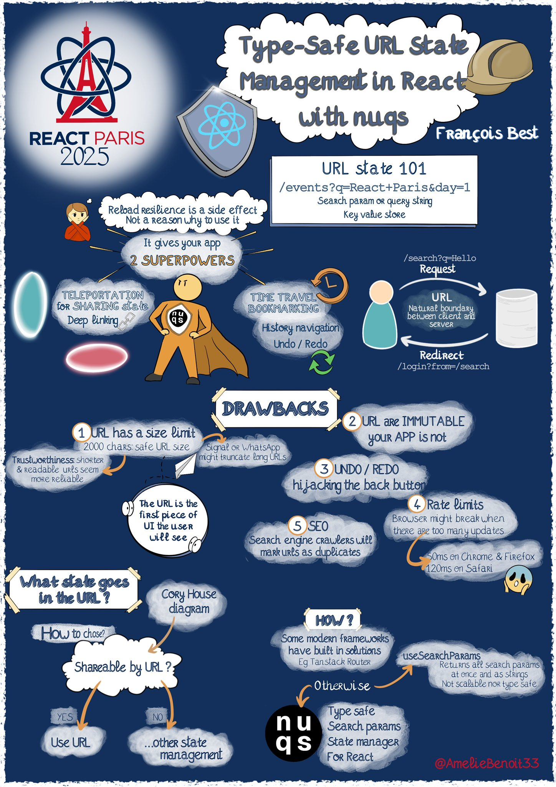
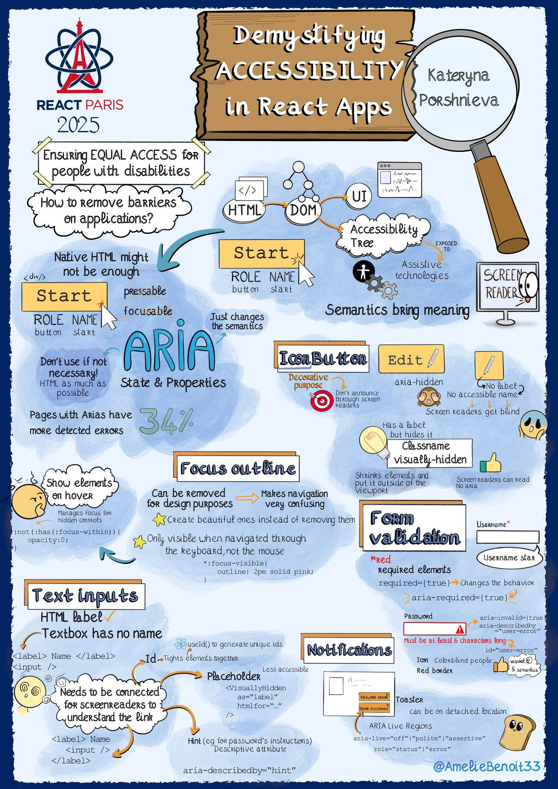
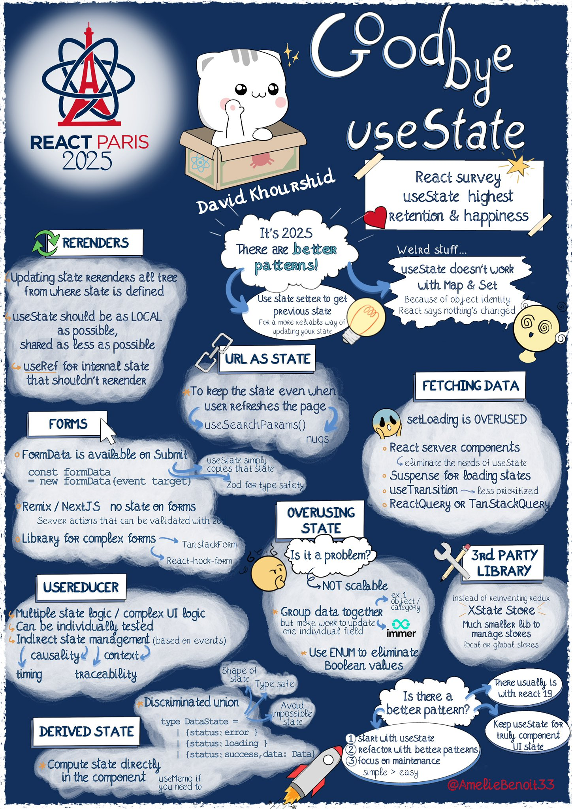

# React Paris 2025

All the recordings are available [here](https://youtube.com/playlist?list=PL53Z0yyYnpWitP8Zv01TSEQmKLvuRh_Dj&feature=shared).

## I Can’t Believe It’s Not JavaScript

By **Jemima Abu**

> When building interactive features on a webpage, JavaScript is usually the way to go. However, with great JavaScript dependencies comes great website instability. Even a minor undefined element can cause your entire webpage to crash.
>
> That’s where going back to the basics comes in. Thanks to modern Web APIs, it’s now possible to reduce JavaScript dependency on a website by swapping out JS components for their native HTML element or CSS feature counterparts.
>
> In this talk, we’ll take a look at how to use HTML and CSS to build simpler alternatives to popular JavaScript components such as accordions, modals, scroll transitions, carousels etc We’ll also take a look at the performance and accessibility benefits and real-life applications and use-cases of these components.

[Recording](https://youtu.be/h_tMtyvVPY0?feature=shared)

## Building a design system with React in 2025, what's new?

By **Jean Burellier**

> Design systems have been part of the world for more than a decade, some of them being provided and maintained by huge companies while other are a 100% lead by the Open Source community. With all the existing solutions, why would you like to create your own design system?
>
> In 2024, we started the endeavor off building our own design system, without relying on existing technologies, allowing us to deeply customize our needs and tailor the solution to all our users, both internals and externals.
>
> Reusability, performance, standardization, accessibility... The previous points are the some of the reasons why building from scratch can make sense.
>
> After a year, from 0 component to more than 50 today, now powering more than 300 websites and mobile applications, with 500+ daily engineers using it, let me share with you our victories and our failures.
>
> This talk directly aims to show the road taken in building such design system, displaying our reasoning and the technical choices that we had to take.

[Recording](https://youtu.be/JWsp_L6N_qg?feature=shared)

## Bridging Code and Creativity: Level Up Your Game as a Frontend Engineer

By **Yu Ling Cheng**

> Behind every successful feature lies a story of collaboration. As a frontend engineer, you’re not just implementing designs—you’re shaping user experiences and influencing product outcomes. This talk will guide you through the feature development lifecycle, highlighting how you can bring unique value to the table at every step.
>
> We’ll dive into real-life examples of tackling edge cases, ensuring consistency across the product, pushing for accessibility, and providing technical insights to balance creativity with feasibility.
>
> Whether you’re early in your frontend journey or are a seasoned engineer, this talk will offer tools to support your growth or inspire ideas to share with your team.

[Recording](https://youtu.be/rdspbWaySjs?feature=shared)

## Type-Safe URL State Management in React with nuqs

By **François Best**

> There are many ways to manage state in modern React applications, but the URL itself is a powerful hidden state manager that’s often overlooked. This talk introduces `nuqs`, a library that simplifies URL state management in React. We’ll explore the benefits this approach: shareability, history navigation, and declarative client-server interaction.
>
> Through a live demo, you’ll learn how to migrate from React.useState to nuqs’ useQueryState while we navigate concepts like client-only vs server-aware search parameters. We’ll also cover good practices for type-safe, pretty URLs, and how to avoid common pitfalls such as browser rate limits and URL size constraints. If you’ve ever wondered what state belongs in the URL, and how to scale it, this talk will give you the answers.

[Recording](https://youtu.be/U__Rwsp8v78?feature=shared)

## Demystifying Accessibility in React Apps

By **Kateryna Porshnieva**

> Web Accessibility is nuanced and can be a tough topic to navigate and get right. In this talk, I aim to provide a practical guide to web accessibility in React apps, completed with many interactive examples.
>
> We’ll start with brief introduction to web accessibility as a whole, we will explore the way assistive technology interacts with web pages, how accessibility tree is constructed and used to navigate web content. Then, we’ll go over a few common patterns in React apps and how to implement without compromising accessibility. This is going to be fun!

[Recording](https://youtu.be/tFO0-aMxitY?feature=shared)

## Goodbye, useState

By **David Khourshid**

> State management is easy, until it's not. Sure, useState() is fine for simple component state management – that's literally what it's for. But as our React apps grow in complexity, the inevitable long chain of useStates make it more difficult to understand and maintain app logic, turning our components into Rube Goldberg machines.
>
> React 19 opens up a whole new world of state management patterns that actually make sense for local, shared, and global state. In this talk, we'll transition from using useState() everywhere to discovering how server components, URL parameters, and more can make state management much simpler. We'll also revisit classic hooks, learn about new hooks, and see how 3rd-party state management libraries and local-first apps can be use-ful.
>
> Let's say goodbye (mostly) to useState(), and hello to a future where state management isn't just a stack of setStates.

[Recording](https://youtu.be/aGkscOKWQvQ?feature=shared)

