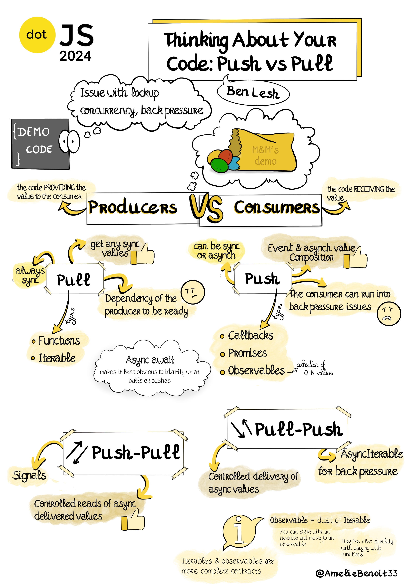
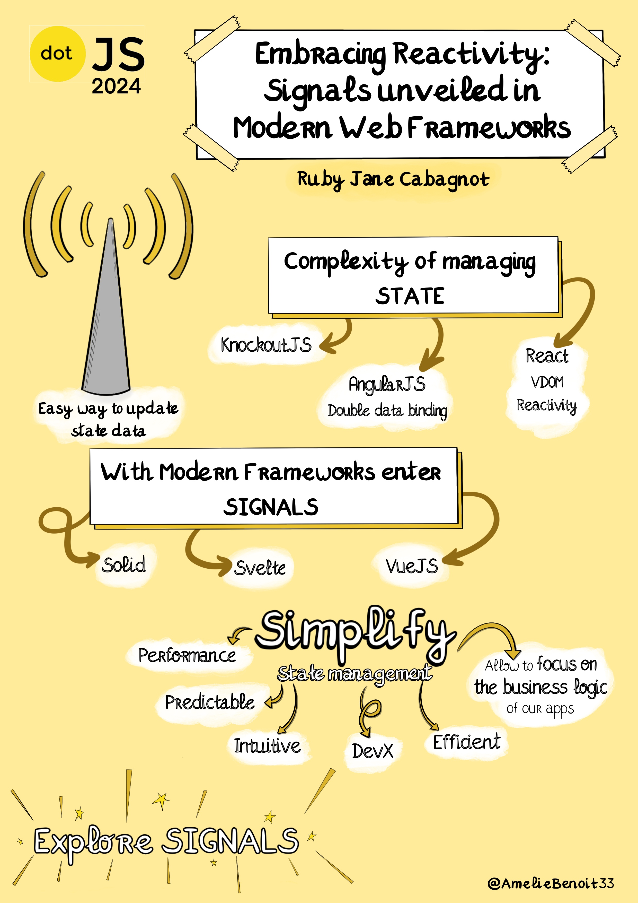
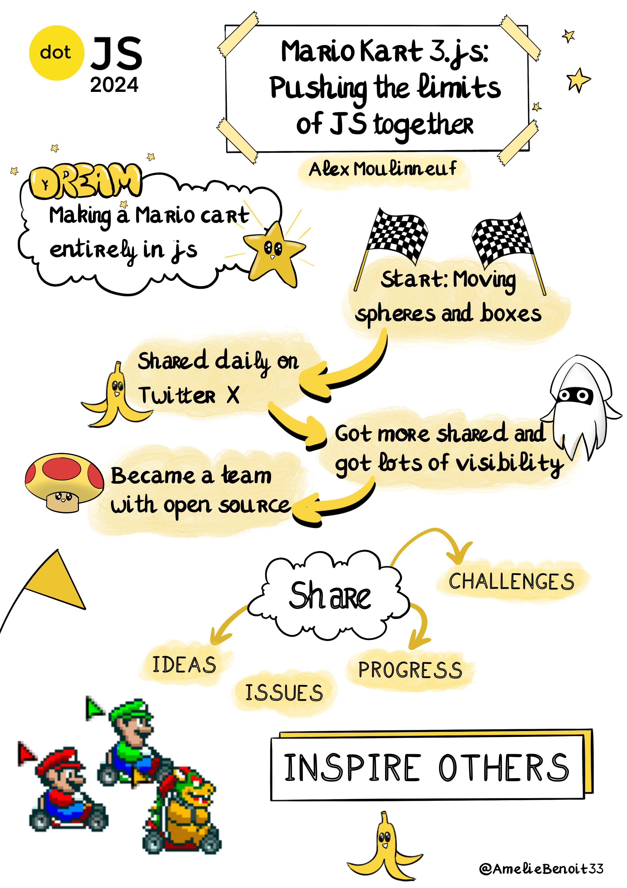
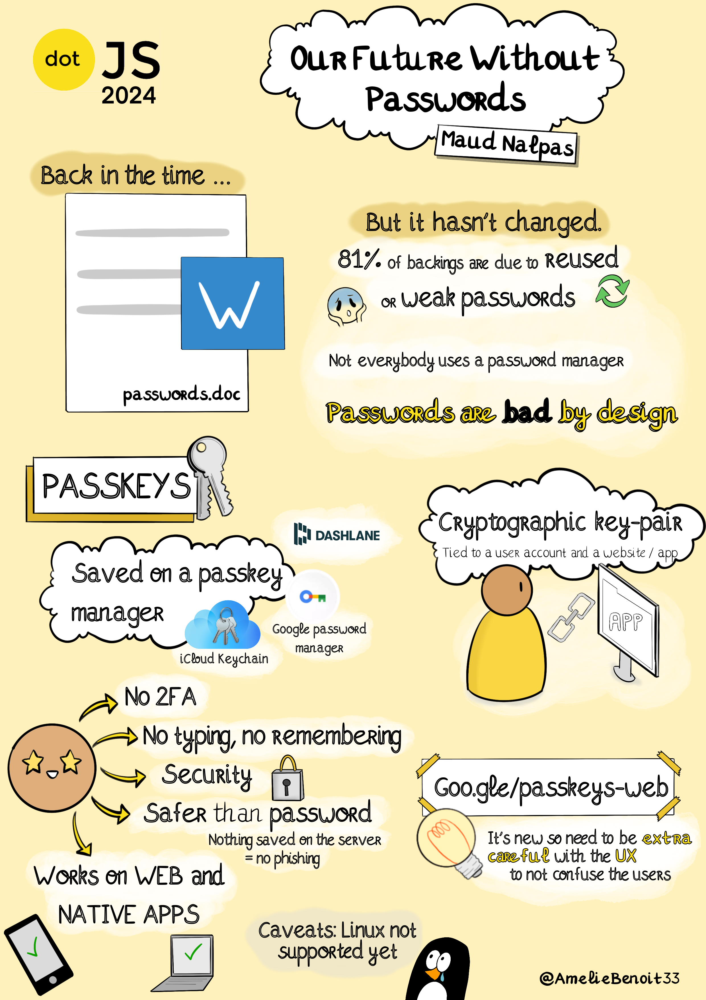
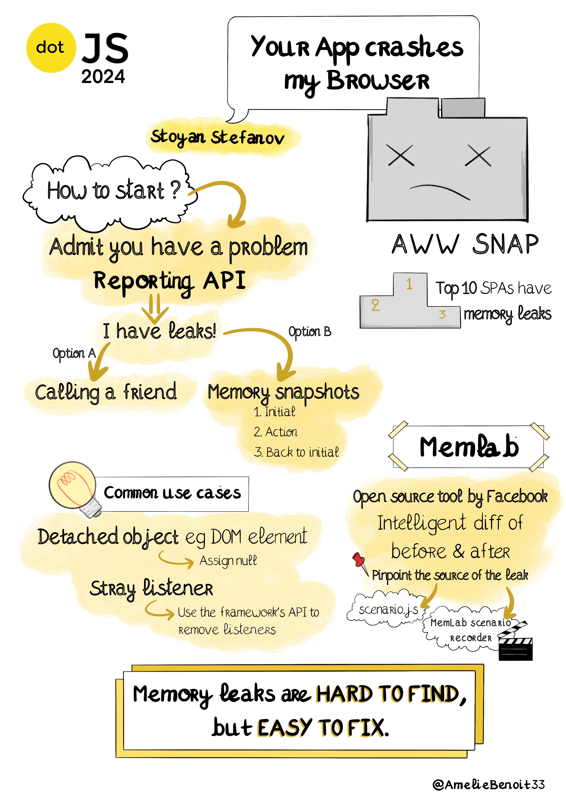

# DotJS 2024

All the recordings are available [here](https://youtube.com/playlist?list=PLMW8Xq7bXrG7fOUOLJQw9I7ygJCbue9zO&feature=shared).

## API design is UI design

By **Lea Verou**

> You may think that usability principles are something that is only relevant to visual designers. However, every time you write a function, a class, or a component, you are creating a user interface. Every time you use someone else’s component, or a utility library, or even the browser’s native APIs, you are using a user interface. Great APIs follow user-centered design principles just as much as visual interfaces, and APIs that are painful to use tend to be designed in a vacuum, removed from the actual user needs they are designed to serve. In this talk you will learn the principles that make APIs dreadful or delightful to use, distilled from Lea’s experience reviewing proposals for new Web technologies as a W3C TAG member, creating & managing dozens of successful open source projects for over a decade with thousands of merged pull requests, and doing a PhD on this very subject, at MIT.

[Recording](https://youtu.be/g92XUzc1OHY?feature=shared)

## Think about your code: push vs pull

By **Ben Lesh**

> We're going to explore a different way of thinking about code. What does it mean for your code to "push"? What does it mean to "pull"? What primitives exist in JavaScript, and what are their strengths and weaknesses?

[Recording](https://youtu.be/txVeRpN_870)

## Dante Inferno Fullstack Development

By **James Q Quick**

> The last 5 years in Web Development brought a whirlwind of changes, acronyms, and contrasting opinions as “best practices” constantly evolve. From static first to server everything, it feels like we’ve been circling down Dante’s 9 Circles of Hell. Join this talk for a discussion around the evolution of Web Development. We’ll explore the rise and sudden fall of the Jamstack, the overwhelming amount of rendering strategies, and most recently, the renewed emphasis on the server. The more you understand about where we’ve been and why, the more prepared you’ll be for the future!

[Recording](https://youtu.be/ajbxNZc6uTc?feature=shared)

## Embracing Reactivity: Signals unveiled in modern web frameworks

By **Ruby Jane Cabagnot**

> As the landscape of web development evolves, so does the complexity of managing state and reactivity in our applications. This talk delves into the core concept of signals—a fundamental building block of reactivity in modern web frameworks like SolidJS and Svelte. We'll explore how signals simplify state management, enhance performance, and improve the developer experience.

[Recording](https://youtu.be/yYkDLyahTV8?feature=shared)

## Mario Kart 3.js: pushing the limits of JS together

By **Alex Moulinneuf**

> I started a 3D rendering project in JavaScript and shared my journey through building in public. The JS community joined in, and together, we took the project to incredible heights. This experience transformed my career. And so it can transform yours. Start building in public to push your projects even further than what you could ever imagine!

[Recording](https://youtu.be/LNxVWnGcn4Y?feature=shared)

## Our future without passwords

By **Maud Nalpas**

> Picture the future. What do you see? Flying cars? Vacations in space? How about…not having to use passwords anymore? Well, welcome to that future. I’ll take you on a journey through our future where you can log in to a site or app by unlocking your phone and show you how to build your own authentication system using passkeys. Passkeys are a significantly safer replacement for passwords: they cannot be reused, don't leak in server breaches, and protect users from phishing attacks. They are built on open standards and work across most popular platforms and browsers such as Chrome, Android, Windows, Edge, MacOS, iOS and Safari. The session is relevant to anyone working on a project with any sort of login functionality.

[Recording](https://youtu.be/ABl_fuIl4Lc?feature=shared)

## Your app crashes my browser

By **Stoyan Stefanov**

> Memory leaks in JS are a blind spot for many (I'd guess most) web apps and we need to spread awareness. How to know if your app leaks memory in the wild (reporting API), how to find leaks (memlab by Facebook + my recorder extension) and how to fix them (usually the easiest)

[Recording](https://youtu.be/ZPpEkRTTH-U?feature=shared)

